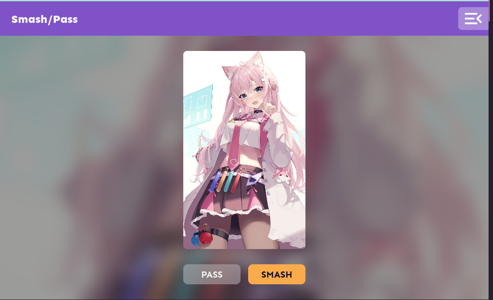

# App: _**Smash or Pass**_ - Waifus Edition

Este es un juego de _**Smash or Pass**_ de personajes femeninos de anime.

### ¿Qué es _**Smash or Pass**_?

- Según 🤓 [Wikipedia](https://es.wikipedia.org/wiki/Smash_or_pass%3F): _**Smash or pass**_? (¿Darle o pasar?) es un juego en el que los jugadores evalúan la deseabilidad sexual de un individuo y declaran si **hipotéticamente** querrían "darle" 👍 (el _smash_, tener sexo con él) o "pasar" 👎 (el _pass_, elegir no hacerlo). El tema de discusión puede ser una celebridad, un personaje ficticio o un individuo conocido personalmente por los jugadores.
- El nombre proviene de un significado de argot en inglés de _smash_ que significa "tener sexo casual".
- La terminología del juego también se usa **metafóricamente** para evaluar cosas fuera de la esfera sexual, como la comida o las actuaciones en festivales.

## Tecnologías usadas

> **Aclaraciones:** (FAQs)
>
> No ha sido probado para tener soporte crossbrowsing
>
> Ha sido programado con fines de entretenimiento

<!-- 

 -->

---

## 📄 Licencia

MIT Public License v3.0
No puede usarse comercialmente
